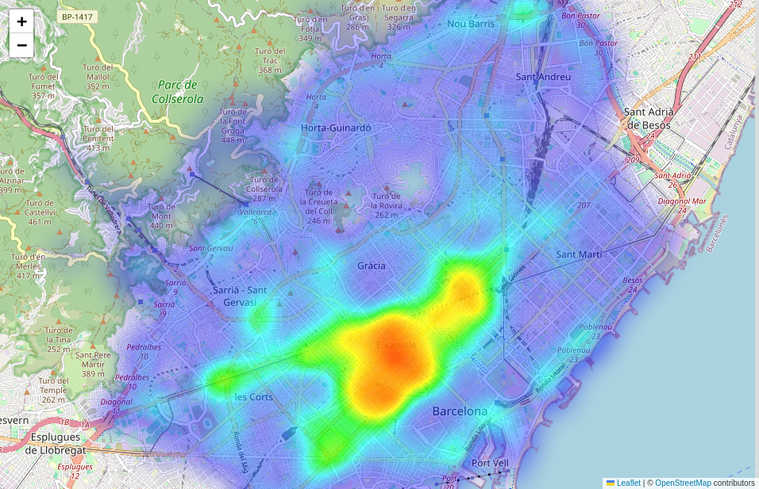
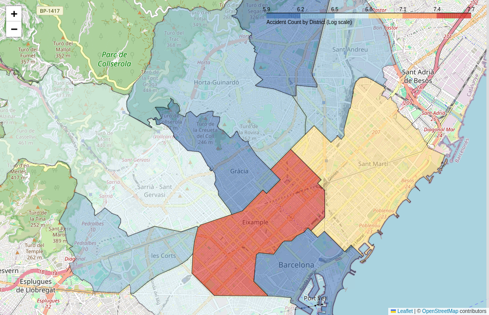
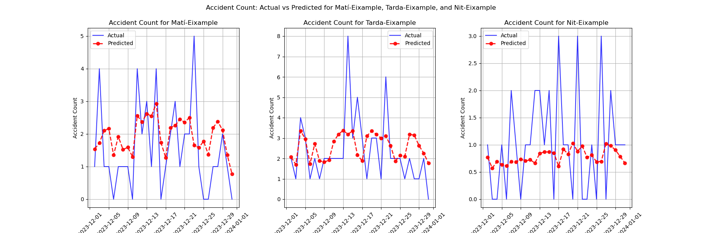

             

🇪🇸 **Català**

# Pronòstic d'Accidents de Trànsit a Barcelona

## Descripció del Projecte

Aquest projecte es va completar com a part del Hackathon de Ciència de Dades organitzat pel Saló d'Ocupació. L'objectiu principal era generar i entrenar un **model predictiu per preveure el nombre d'accidents de trànsit** en funció dels torns i districtes de Barcelona. Donada la naturalesa oberta del conjunt de dades, vaig optar per abordar-lo com un problema de previsió de sèries temporals. Aquest mètode permet la previsió del nombre d'accidents per districte i torn, proporcionant informació útil. Específicament, això **permet a les forces de seguretat assignar recursos de manera eficient** en funció dels números anticipats d'accidents, millorant així tant la planificació operativa com la seguretat pública. Al fer servir el conjunt de dades d'**Accidents gestionats per la Guardia Urbana a Barcelona per causa**, l'anàlisi té com a objectiu millorar l'efectivitat de l'assignació de recursos i les estratègies de resposta.

🇪🇸 **Español**

# Pronóstico de Accidentes de Tráfico en Barcelona

## Descripción del Proyecto

Este proyecto se completó como parte del Hackathon de Ciencia de Datos organizado por el Saló d'Ocupació. El objetivo principal fue generar y entrenar un **modelo predictivo para pronosticar el número de accidentes de tráfico** en función de los turnos y distritos de Barcelona. Dada la naturaleza abierta del conjunto de datos, elegí abordarlo como un problema de pronóstico de series temporales. Este método permite la previsión del número de accidentes por distrito y turno, proporcionando información útil. Específicamente, esto **permite a las fuerzas de seguridad asignar recursos de manera eficiente** en función de los recuentos anticipados de accidentes, mejorando así tanto la planificación operativa como la seguridad pública. Al aprovechar el conjunto de datos de **Accidentes gestionados por la Guardia Urbana de Barcelona por causa**, el análisis tiene como objetivo mejorar la efectividad de la asignación de recursos y las estrategias de respuesta.

🇬🇧 **English**

# Traffic Accident Forecasting in Barcelona

## Project Overview

This project was completed as part of the Data Science Hackathon organized by Saló d'Ocupació. The main objective was to generate and train a **predictive model to forecast the number of traffic accidents** based on shifts and districts in Barcelona. Given the open-ended nature of the dataset, I chose to approach it as a time-series forecasting problem. This method allows for the forecasting of accident counts per district and shift, providing actionable insights. Specifically, this **enables security forces to allocate resources efficiently** based on anticipated accident counts, thereby improving both operational planning and public safety. By leveraging the **Accidents managed by the Guardia Urbana in Barcelona by cause** dataset, the analysis aims to enhance the effectiveness of resource allocation and response strategies.

## Dataset Description

The dataset contains daily information for the year 2023 regarding accidents across various districts, neighborhoods, and streets in Barcelona.

### Key Variables

- `Numero_expedient`: Unique identifier for each accident case.
- `Codi_districte` / `Nom_districte`: Code and name of the district where the accident occurred.
- `Codi_barri` / `Nom_barri`: Code and name of the neighborhood where the accident occurred.
- `Nom_carrer`: Name of the street where the accident occurred.
- `Descripcio_dia_setmana`: Day of the week when the accident happened (e.g., Divendres - Friday).
- `Hora_dia`: Time of day when the accident occurred.
- `Descripcio_causa_mediata`: Primary cause of the accident (e.g., "No respectar distàncies" or "Desobeir semàfor").
- `Latitud_WGS84` / `Longitud_WGS84`: Geographic coordinates (latitude and longitude) in the WGS84 system.

## Data Cleaning

The data cleaning process involved:

1. **Removing empty spaces** from column names and other features.
2. **Eliminating duplicate accident records** to prevent double counting.

### Additional Cleaning Steps
- **Data Type Conversion**: Ensured that date fields are in proper datetime format and categorical variables are correctly identified.
- **Outlier Detection**: Implemented methods to identify and handle outliers in numeric fields.
- **Normalization/Standardization**: Applied normalization to continuous variables to ensure uniformity in scale.

## Exploratory Data Analysis (EDA) Insights

- The district with the highest accident rates is **Eixample**, with accidents peaking during the **afternoon** and **night** shifts.
- Significant accident occurrences were also noted in **Sant Martí** and **Sarrià**.
- Neighborhoods with the highest accident frequencies include **La Dreta de l'Eixample** and **Fort Pienc**.
- Accident-prone streets in Barcelona include **Carrer d'Aragó**, **Gran Via de les Corts Catalanes**, and **Avinguda Diagonal**.
- These patterns are illustrated in both the following heatmaps and interactive Folium maps. For detailed street-level insights, refer to the HTML file where you can zoom in on specific streets.

### Map 1: Accident Heatmap

The first map displays a **heatmap** highlighting accident hotspots across Barcelona. Red areas indicate a higher density of accidents, while green and blue areas show fewer incidents.

### Map 2: Accident Count by District

The second map uses a **color scale** to represent the number of accidents by district. Districts are delineated and colored according to the accident count, using a logarithmic scale where darker colors represent a higher number of incidents.

## Accidents Forecasting

### Approach and Rationale
Given the dataset is limited to only the year 2023, the analysis focuses on the district and shift level of granularity (`Descripcio_torn` + `Nom_districte`). This aggregation ensures sufficient data for each `unique_id` while capturing meaningful temporal and spatial patterns.

### Feature Engineering
I constructed several time series features to enhance the predictive power of the model, including:

- **Temporal Features**:
  - `day`: The day of the month extracted from the date.
  - `dayofweek`: The day of the week represented as an integer (0 for Monday, 6 for Sunday).
  - `namedayweek`: The name of the day of the week (e.g., Monday, Tuesday).
  - `month`: The month of the year.
  - `quarter`: The quarter of the year.

- **Categorical Features**:
  - `shift`: The shift derived from the `unique_id`.
  - `district`: The district derived from the `unique_id`.

- **Holiday and Weekend Indicators**:
  - `holiday`: A binary indicator for holidays (1 for holidays, 0 otherwise).
  - `weekend`: A binary indicator for weekends (1 for Saturday and Sunday, 0 otherwise).

- **Sinusoidal Transformations**:
  - `month_sin` and `month_cos`: Sin and cosine transformations of the month to capture cyclical patterns.
  - `day_sin` and `day_cos`: Sin and cosine transformations of the day to capture cyclical patterns.

- **Lag Features**:
  - Created multiple lagged features for the target variable (`accident_count`), including:
    - `lag1`, `lag2`, `lag7`, `lag30`: Lagged values for 1, 2, 7, and 30 days.
    - Rolling means and standard deviations for lags of various window sizes.

- **Grouped Features**:
  - Aggregated lag features based on groupings such as `shift`, `district`, and `namedayweek`, using aggregation functions like sum, max, min, and mean.

These features were designed to capture both the temporal dynamics of accident occurrences and the effects of various categorical factors, enhancing the model's ability to predict accident counts effectively.

### Dataset Splitting
The dataset was sorted and split into training, validation, and test sets based on unique dates:

- **Training Set**: From **2023-01-01** to **2023-12-11** (all data except for the last 20 days).
- **Validation Set**: From **2023-12-12** to **2023-12-21** (days -20 to -10).
- **Test Set**: From **2023-12-22** to **2023-12-31** (the last 10 days).

### Challenges in Forecasting
One of the challenges in forecasting accident counts was the presence of significant dates such as Christmas and New Year's. These holidays can lead to atypical patterns in accident occurrences, making it difficult to generalize from historical data. The dataset was limited to 2023, which restricted the ability to incorporate trends from previous years.

### Model Results
I utilized both **LightGBM** and **CatBoost** for forecasting:

- **LightGBM**:
  - Train MAE: 0.5791
  - Validation MAE: 0.6733
  - Test MAE: 0.5788

- **CatBoost**:
  - Train MAE: 0.6229
  - Validation MAE: 0.6680
  - Test MAE: 0.5625

The final MAE, taking the mean of both models' predictions, was **0.5692**. The `dayofweek` feature was among the top three most important features, indicating its significance in predicting the number of accidents. I also used **Optuna** for hyperparameter tuning, achieving the following results:

- Ensemble MAE: 0.5680
- LightGBM Test MAE: 0.5776
- CatBoost Test MAE: 0.5597

### Predictions for last 10 days in Eixample

As the plots show, the model could be further improved. I am confident that this would be the case if I had access to data from previous years for the same days, allowing for a better understanding of patterns and trends during special dates and holidays.

### Future Enhancements
- **Increased Granularity**: With additional historical data, the model can be refined to include more detailed time intervals (e.g., street-level and hourly accident counts).
- **Incorporating More Features**: Future datasets could integrate detailed temporal features (e.g., specific hours, weather conditions) to further improve predictive accuracy.

## Data Source

The data used in this analysis was downloaded from the Barcelona City Council Open Data portal. The original dataset is available at the following link:

[Accidents managed by the Guardia Urbana in Barcelona by cause](https://opendata-ajuntament.barcelona.cat/data/ca/dataset/accidents_causa_conductor_gu_bcn/resource/5a040155-38b3-4b19-a4b0-c84a0618d363)

